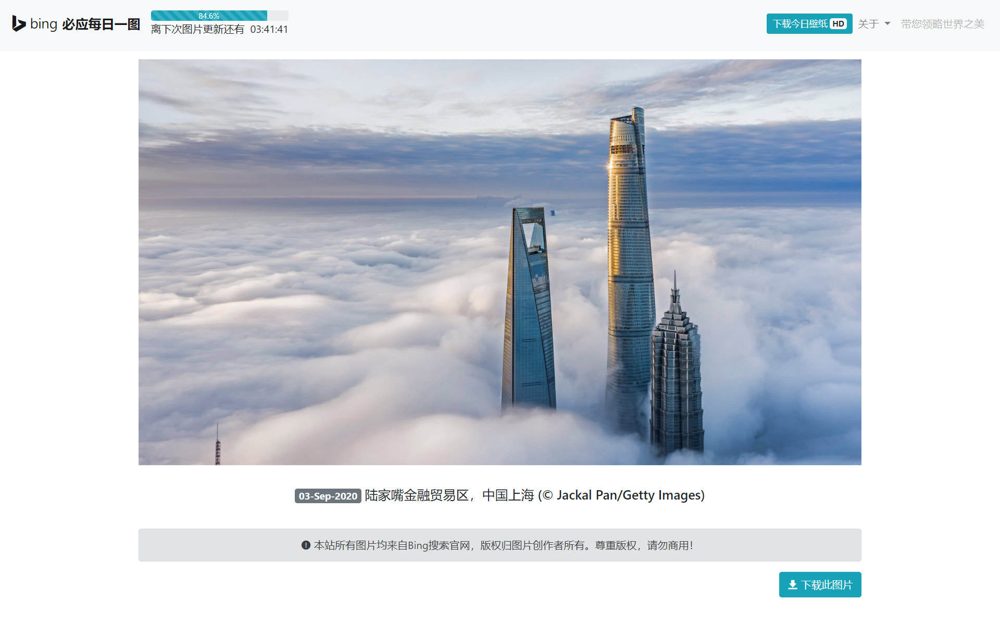

# Bing-upyun
# 轻量必应每日一图接口/前端，支持上传到又拍云调用


> ### :warning: 注意：此项目已停止维护！
> 
> 若有需要，请移步： [bing-vue](https://github.com/androidmumo/bing-vue)，使用vue3构建的必应每日一图。
> 
> 此项目以后不会添加新功能，但可能会有修复bug的更新。
> 
> 若为得到较好的CDN优化，此项目仍然是个好选择。


### 1.简介

- 轻量、迅速、无占用
- 优雅的响应式前端界面，可静态部署

- 前后端分离，后端接口可单独部署
- 又拍云存储加速
- 丰富的接口功能





众所周知，必应搜索官网每天会更新一张高质量的背景图。许多同学想在接口中调用它们，但必应的服务器在国内不算特别稳定（>500ms）。Bing-upyun 可以把每天的必应图片上传至又拍云，提供支持图片处理、回溯的接口（又拍云直链，实测从请求到图片接收完成耗时300ms左右，视网络情况而不同），并可选部署优雅的前端页面。

目前有很多优秀的必应每日一图接口，可以将图片在服务器本地化存储并提供调用接口，但大都需要常驻后台运行。另外，目前几乎没有采用又拍云储存图片的同类接口。因此便有了下面的项目。


> 诗曰：“ 沉舟侧畔千帆过，病树前头万木春。”
>
> 请跟随必应的脚步，带您领略世界之美。


### 2.前端

##### 2.1 前端 DEMO

```
https://bing.nxingcloud.co/
```


##### 2.2 前端效果（首页）


##### 2.3 前端特性

用到的库或者框架有：Bootstrap4、jQuery1.11.0、Valine、[progressive-image](https://github.com/ccforward/progressive-image)。

- 响应式

- 图片懒加载

- 图片渐进加载（模糊到清晰）

- 无后台评论系统

  

### 3.后端

##### 3.1 接口文档

|  参数名   |   是否必须   |            参数            |            返回结果             |                             备注                             |
| :-------: | :----------: | :------------------------: | :-----------------------------: | :----------------------------------------------------------: |
|   type    |      否      |         json或其他          |            json数据             |             参数除json外，其余都无效（输出图片）             |
|   blur    |      否      |          5/15/25           |   返回高斯模糊程度不同的图片    |                    只支持5/15/25三个等级                     |
|   gray    |      否      |         true/false         |      灰阶图片/正常色彩图片      |                              -                               |
|    day    |      否      |  数字n（大于等于0的正整数）  |           n天前的图片           |                  n的范围取决于程序运行天数                   |
| thumbnail |      否      |            1/25            | 16×9像素或以25%比例缩放的缩略图 | 只支持1/25两个等级，16×9像素的缩略图用来实现前端图片的渐进加载 |
|  random   |      否      |        true/false          |                -                |       随机返回自网站开始运行至当前时间任意一天的图片         |

注意：`day` 和 `random` 两者之间只能选择一个参数，这两者参数和其余参数可以组合使用，除此之外的其他参数之间暂不支持组合使用。例如，不能返回灰阶的高斯模糊图片，可以返回n天前的高斯模糊图片。


##### json数据格式：

```
{
"bing_id": "21",
"bing_title": "日落时分中央海岸入口海滩上的救生员小屋，澳大利亚新南威尔士州 (© Yury Prokopenko/Getty Images)",
"bing_imgurl": "https://upyuns.mcloc.cn/bing/15-Sep-2020/15-Sep-2020.jpg",
"bing_imgurlcom_25": "https://upyuns.mcloc.cn/bing/15-Sep-2020/15-Sep-2020-compress_25.jpg",
"bing_imgurluhd": "https://cn.bing.com/th?id=OHR.LifeguardEntrance_ZH-CN7394984988_UHD.jpg",
"bing_imgname": "LifeguardEntrance_ZH-CN7394984988",
"bing_hsh": "a8712ff7ed3690123f96c2f95830b9f6",
"submission_date": "15-Sep-2020",
"submission_fulldate": "15-Sep-2020 00:01:01",
"bing_imgbase64": "data:image/jpeg;base64,/9j/4AAQSkZJRgABAQEASABIAAD/2wBDAAMCAgMCAgMDAwMEAwMEBQgFBQQEBQoHBwYIDAoMDAsK\r\nCwsNDhIQDQ4RDgsLEBYQERMUFRUVDA8XGBYUGBIUFRT/2wBDAQMEBAUEBQkFBQkUDQsNFBQUFBQU\r\nFBQUFBQUFBQUFBQUFBQUFBQUFBQUFBQUFBQUFBQUFBQUFBQUFBQUFBQUFBT/wAARCAAJABADAREA\r\nAhEBAxEB/8QAFwAAAwEAAAAAAAAAAAAAAAAAAgMHCP/EACUQAAEEAQMCBwAAAAAAAAAAAAECAwQF\r\nEQAGEgcxNDdhc3Sxs//EABcBAAMBAAAAAAAAAAAAAAAAAAMFBgT/xAAnEQABAwIEBQUAAAAAAAAA\r\nAAABAAIDESEEEnGREzI0grExYXKBof/aAAwDAQACEQMRAD8ALpfa2VFBdK26liOlAdczeMFsN8iA\r\noBSVcRkEA5HbQ8bNhwQDMAdKn8KosCcrXF0VR8qDYhJuJx3Nf2KLawiSYrLCVsR2JraXIzKSAQt5\r\nZwvuMEJHoDjS5mJcM2V7aXob1P0AKblbomwSPdx2kelqiw9yTfZZz2L5Ebz+cz9alJ+rj0Q4eil1\r\nCpEjwF57VZ+Wlw5m93lNhySdvhf/2Q==\r\n",
"other": "0",
"bing_did": "20200915"
}
```

|        字段         |            值             |               备注               |
| :-----------------: | :-----------------------: | :------------------------------: |
|       bing_id       |            ID             |                                  |
|     bing_title      |         图片标题          |                                  |
|     bing_imgurl     |    1920×1080 图片地址     |                                  |
|  bing_imgurlcom_25  |     480×270 图片地址      |                                  |
|   bing_imgurluhd    |    UHD超高清 图片地址     | 注意：分辨率不固定、无又拍云加速 |
|    bing_imgname     |     图片文件原始名字      |  注意：与又拍云中的文件名不一致  |
|      bing_hsh       |          哈希值           |                                  |
|   submission_date   |       提交保存时间        |                                  |
| submission_fulldate |     详细提交保存时间      |                                  |
|   bing_imgbase64    | 16px×9px 缩略图base64编码 |       一般用于图片渐进加载       |
|        other        |         保留字段          |                                  |
|      bing_did       |        唯一图片ID         |          格式为保存日期          |


##### 3.2 接口DEMO

```
https://bing.nxingcloud.co/api
```

此接口为[小马奔腾](https://blog.mcloc.cn/)免费提供，支持最新的特性（可能含有Beta版功能），请合理使用。


### 4.部署

#### 4.1 后端部署

##### 4.1.1 准备工作

在开始之前，请确保您具备以下必要条件：

1. 又拍云存储库

2. MySQL数据库

3. PHP运行环境

4. 在又拍云中创建图片处理服务

在您的又拍云存储库-图片处理-创建缩略图版本中创建版本名称分别为bing1和bing25的自定义图片处理服务，其中：

- bing1：缩略方式选择限定宽度，高度自适应，限定尺寸为16px，图片质量为100%，其它不变。

- bing25：缩略方式选择限定宽度，高度自适应，限定尺寸为480px，图片质量为100%，其它不变。

如图所示：


   

##### 4.1.2 目录结构

若要在服务器上同时部署前后端，您的目录结构看起来应该是下面这样：

（若只需要后端接口，则只部署 `api` 下的文件即可）

    ├── api
    │   ├── php
    │   │	├── bing		// 图片缓存文件夹
    │   │	├── config.php	// 配置文件
    │   │   └── index.php	// 后台图片处理程序
    │   └── index.php		// 图片调用接口
    ├── css
    │   ├── detail.css		// 详情页样式表
    │   ├── index.css		// 首页样式表
    │   └── main.css		// 主样式表
    ├── html
    │   └── detail.html		// 详情页
    ├── js
    │   ├── detail.js		// 详情页js
    │   ├── index.js		// 首页js
    │   └── main.js			// 主js
    ├── lib					//第三方库
    │   ├── layer
    │   ├── Valine.min.js
    │   ├── bootstrap.min.css.map
    │   ├── bootstrap.min.css
    │   ├── bootstrap.min.js.map
    │   ├── bootstrap.min.js
    │   ├── jquery-1.11.0.js
    │   ├── progressive-image.css
    │   └── progressive-image.js
    ├── static				//静态资源
    │   └── upyun_logo5.png
    └── index.html			// 首页


##### 4.1.3 配置信息

在 `api/php/config.php` 中修改：

```php
//又拍云连接信息
$config['bucketName']    = '********';  //你的又拍云存储库
$config['operatorName']  = '********';  //你的存储库操作员
$config['operatorPwd']   = '********';  //你的存储库操作员密码
$config['domainName']    = '********';  //又拍云加速域名。注：结尾的 / 不能省略。如：'https://upyun.yourdom.com/'

//数据库信息
$config['mysqlHost']     = '********';  //MySQL数据库主机名
$config['mysqlUsername'] = '********';  //MySQL数据库用户名
$config['mysqlPassword'] = '********';  //MySQL数据库密码
$config['mysqlDbname']   = '********';  //MySQL数据库名
```


##### 4.1.4 部署文件到服务器

部署至可访问目录即可。

注意：`/api/php/bing`文件夹需要有写入权限。


##### 4.1.5 设置定时任务（重要）

本程序不会常驻后台，需要定时访问后台图片处理程序所在URL以触发程序执行（每天访问一次）。

定时任务访问URL： `网站根目录/api/php/index.php` 或 `网站根目录/api/php`

接口调用URL： `网站根目录/api/index.php` 或 `网站根目录/api`

为避免时间误差引起的问题，建议**不要**将定时任务设置在每天的 00:00:00 ，推荐将定时任务设置在每日 **00:01:00** ，若如此做，则在完成以上步骤后，不需要额外设置。否则请参照以下规则：

 `api/php/config.php` 中的`$config['delay']`为延时时间，如 `$config['delay'] = 90;` 即调用80s前的图片。这也就意味着，您在每天零点的90s后，才能收到当天最新的图片。在每天的 00:00:00 至 00:01:30 之间，您调用此接口返回的仍然是前一天的图片。

注意：此延时时间需比定时任务中访问URL的时间大30s左右（和网络情况有关），否则会长时间返回前一天的图片（太大）或出现404错误（太小）。


#### 4.2 前端部署

##### 4.2.1准备工作

Bing-upyun 的前端可以纯静态部署。

为了提升您的访问速度，建议为前端页面部署CDN加速。

CDN建议的缓存设置如下：

缓存7天：

```
/*.(htm,html,js,css,png,svg,ico,ttf,otf,woff,woff2,eot,sfnt)
```

不缓存：

```
/*.(php,json)
```


##### 4.2.2 目录结构

目录结构在 4.1.2 中已说明。


##### 4.2.3 配置

###### 4.2.3.1 评论系统

请在 `detail.js` 中修改评论系统 Valine 的信息：

参考 [Valine 官方文档](https://valine.js.org/)

```
appId: '********'
appKey: '********'
```


###### 4.2.3.2 域名

为了最快的响应速度，Bing-upyun 的前端页面为纯静态，请查找并替换以下文件中的域名：

```
index.html
html/detail.html
js/detail.js
js/index.js
js/main.js
```

替换方法：

1. 全局搜索替换，将 `https://bing.nxingcloud.co/` 替换为您部署的域名。
2. 将 `js/main.js` 中的 `https://upyuns.mcloc.cn/` 替换为您的又拍云存储加速域名。
